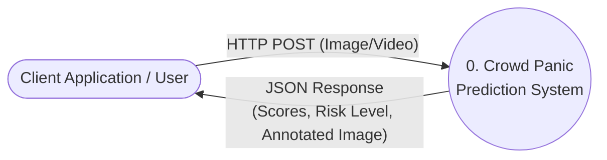
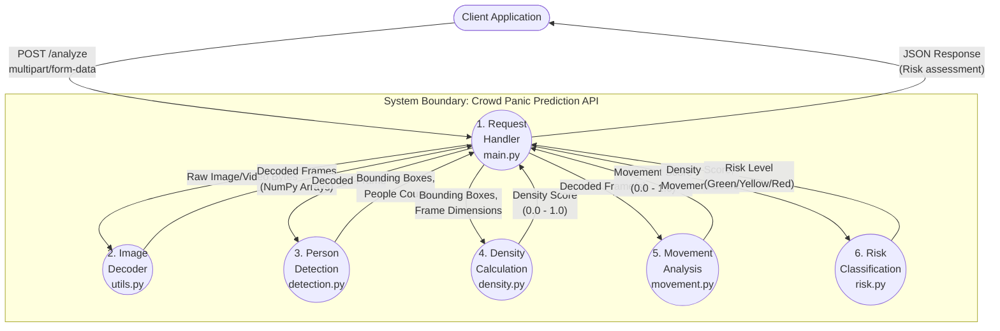

# Data Flow Diagram (DFD) - AI-Based Crowd Panic Prediction System

This document contains the Data Flow Diagrams for the Crowd Panic Prediction System. You can view these diagrams by opening this Markdown file in an editor that supports Mermaid.js (such as VS Code with a Markdown Preview extension, Obsidian, or GitHub).

## Level 0 Context Diagram
This diagram shows the system as a single process interacting with the Client.

---

## Level 1 System Data Flow Diagram
This details the internal flow of data between the FastAPI endpoints and the various Python processing modules (`detection`, `density`, `movement`, `risk`).

